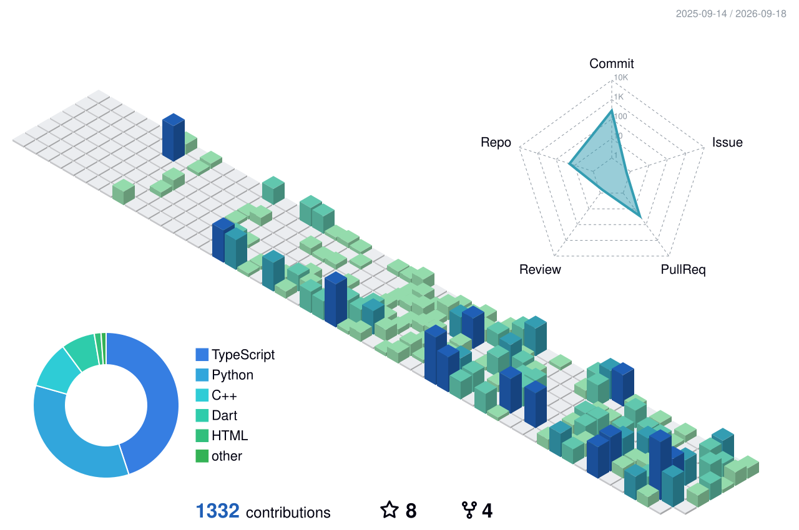

  

  <em>I like to build (...and break) things</em>

  
  
  

## 🧠 About
- 💻 **Software Engineer Intern** @ *Scotiabank*
- 🤖 **AI / ML** @ *Town of Oakville*
- 💼 Prev **AI Engineer Intern** @ *Flite Transport*
-  **President** @ *Google Developer Group Sheridan*
- 🎓 **CS - Data Engineering** @ *Sheridan College*
- 🔭 Focused on **Innovating** with AI, creating with **Data**, and full-stack **PoCs**
- 🚀 Hacking and building in public since **2024**

## 🛠️ Toolbox
**Languages**

  

**Frameworks & Libraries**

  

**Cloud & DevOps**

  

**Databases**

  

**Tools**

  

## 🧩 Cool Projects
| Project | What it is | Stack |
|---|---|---|
| [Ember](https://github.com/georgef166/Ember) — Top 3 North America @ Google Solutions Challenge 2026 + 'Spur Innovation' Tracks @ HackCanada 2026 | An XR firefighter system with software integrated into a mask-mounted headset, plus a commander hub that can place XR guidance objects and highlight doors/hazards in firefighters’ view. | TypeScript + Next.js + WebRTC |
| [Voxel](https://github.com/georgef166/GenAIGenesis2026) — Won Best AI Hack @ GenAI Genesis 2026 | An XR education experience for children that turns learning into an interactive, engaging activity. | Dart + Flutter + Meshy API |
| [Rocky](https://github.com/georgef166/DeerHacks2026) — Won 2nd + Best Use of Vultr @ DeerHacks V | A child safety app that detects risky situations and sends clear, real-time alerts to parents. | TypeScript + Next.js + Gemini API |
| [A11Yson](https://github.com/georgef166/A11Yson) | An accessibility Chrome Extension that adapts any website into easier reading modes for different learning and sensory need. | TypeScript + FastAPI + Chrome Extension |

## 📈 Commit History, in 3D
<!--
  Regenerated daily by .github/workflows/profile-3d.yml.
  Colours come from .github/profile-3d-settings.json (green -> blue ramp,
  with a separate palette for dark-mode viewers). Edit contribColors there.
-->

  

## 🤝 Connect
- LinkedIn: [George Farag](https://www.linkedin.com/in/gfarag/)
- Website: [georgefarag.ca](https://georgefarag.ca/)
- GitHub: [@georgef166](https://github.com/georgef166)
